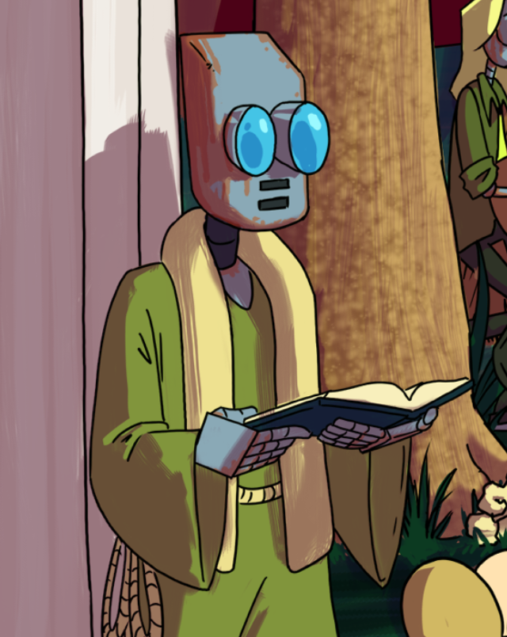
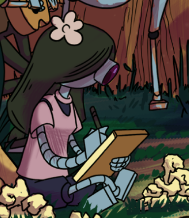

# Kernelle

**A Rust-powered, investigation-to-merge AI development toolshed**

It's an artificial intelligence gold rush, and let's be honest, there are a heck of a lot of shovels piling up.

Instead of building yet another shovel to throw on the pile, this repository is essentially a toolshed. It takes the pre-existing tools currently at our disposal and pulls them together into something developers can actually use for their every day expectations and workflows: 
- triaging tickets
- investigation
- gathering requirements
- writing clean code and tests
- merge reviews, both as the assignee and reviewer.

In essence, this repository takes the next logical step software development's been working towards: a development toolkit to accelerate a typical sprint workflow all the way from investigation and triage up through merge. It provides semantically programmed agent rulesets that leverage a suite of human-friendly, agent-ready CLIs to automate and aide in the most common stages of development.

This toolshed's been designed and tested for real-world development, and has been architected to work effectively with AI-powered IDEs like Cursor for both hobby and enterprise development contexts. It's designed to accelerate you, not replace you.

No, this is not AI-generated hype. I use these tools myself. In fact, I used these tools on themselves to make them much higher quality than I could otherwise do by myself, while still having full say in the way code gets designed and written. **No exaggeration:** the early prototypes of Kernelle were comprised of integration-tested bash scripts that were more legible and more reliable than most of the codebase at my last job.

## Who Is This For?

**Solo Developers:** Use what you need, ignore what you don't. Jerrod for MR reviews, Blizz for personal knowledge management, Violet for local code quality. Everything runs locally - no team buy-in required.

**Small Teams:** Share Blizz insights through a team repository. Use Jerrod on both sides of MR workflows (as reviewer and resolver). Rust's performance handles team-scale insight stores without breaking a sweat.

**Enterprise Teams:** Deploy the full toolkit across development teams. Set up automated Adam jobs in CI/CD to curate and prune a company-wide global insights cache. Jerrod scales to handle high-volume MR workflows while maintaining audit trails and traceability that enterprise security teams love.

The beauty? **You can start solo and scale up organically.** Begin with local tools, add team sharing when ready, expand to enterprise automation when it makes sense. No forced adoption, no vendor lock-in.

## Meet The Team

<table>
<tr>
<td width="200" align="center">

</td>
<td>

### 🔧 Jerrod - GitLab/GitHub MR Review Specialist
*"Methodical precision meets systematic excellence"*

**Problem:** Massive MRs with large amounts of requested changes. Losing track of MR discussions, forgotten review threads, and the mental overhead of context-switching between review sessions.

**Our Solution:** Jerrod's systematic, queue-based review process eliminates scattered feedback and ensures no detail escapes scrutiny, regardless of the scope of the changeset or how much it creeps. Can juggle multiple code review requests in parallel and resume any review exactly where you left off without calling out to your remote.

</td>
</tr>
</table>

**Expertise:**
- **Churns through MR comments one by one** - Literally. Jerrod is the workhorse that got this repository up and working properly.
- **Cross-platform support (GitHub & GitLab)**
- **Local, Session-based review management**
- Thread queue processing with surgical precision
- Like any good engineer, knows how to split off chunks of scope for later.
- Has local access to rich diff context and review discussions
- Automated commit linking and resolution tracking, so you can know what commit fixed what issue on which code review.
- Not so great at parties

**Commands:**
```bash
jerrod start <repo> <mr-number>    # Initialize review session
jerrod status                      # Show current review state
jerrod peek                        # View next thread without removing
jerrod pop [--unresolved]         # Remove thread from queue
jerrod comment <message>           # Add comments to threads
jerrod resolve                     # Mark actual thread as resolved through APIs
jerrod finish                      # Complete and cleanup session
```

---

<table>
<tr>
<td>

### ❄️ Blizz - Zippy Knowledge Acquisition
*"Information gathered at the speed of thought"*

**Problem:** "Where did we have that discussion again? Slack? A Google doc? Coda?" Plus AI context limitations and the time needed to reconstruct task context between sessions.

**Solution:** Blizz connects to ALL your information sources through MCP integration, such as Notion, Jira, Slack, Coda, GitLab, and GitHub. Blends acquired remote knowledge seamlessly with information gleaned from local repositories and discussions to create a unified, searchable knowledge base from your command line. Blizz gives you the knowledge of any subject matter expert, storable and searchable on your machine, playing nice with AI IDEs and Unix commands alike. No more hunting through multiple apps - Blizz pulls it all together, summarizes what matters, and stores it securely without eating your AI token budget.


</td>
<td width="200" align="center">

</td>
</tr>
</table>

**Game-changing Features:**
- **Unified Knowledge Base** - All your scattered information in one searchable place
- **MCP Synergy** - A knowledge storage toolset that's glued to Notion, Jira, Slack, Coda, GitLab, GitHub, and more. Have Blizz do your investigation and design background-work for you. 
- **Get specific answers, fast, on your own:** No more "it's been 4 weeks and at this point and I'm too afraid to ask" feeling. Blizz will keep digging and saving insights until either she's confident about the subject at hand or you are.
- **Works together with Jerrod (and you!)** - Jerrod's MR resolution workflow both uses Blizz's insights and adds to them. As can you through either chat or the CLI.
- **Local & Secure** - Everything stays on your machine, nothing sent to third parties. You can `ls` and `grep` what's there for yourself.
- **AI Token Optimization** - Extended memory that doesn't count against context limits
- **Smart Summarization** - Distills complex discussions into actionable insights
- **Cross-Reference Linking** - Connects related information across your insights
- **Shareability** - The insights cache can be kept locally on one laptop or shared between a team in a repository. At the end of the day, they're just snippets of markdown saved where you want them.
---

<table>
<tr>
<td width="200" align="center">

</td>
<td>

### 📚 Adam - The Record Keeper
*"Not all knowledge is created equal"*

**Problem:** When AI tools generate 200+ insights daily, not all are accurate or remain relevant. Knowledge systems become cluttered with outdated information.

**Solution:** Adam curates your growing insight collection, scoring usefulness and culling outdated information. Maintains a clean "wisdom cache" of proven, valuable knowledge while preventing information overload. If the web is storage, and the model context is RAM, then Blizz is the L2 cache and Adam the L1.

*"A library without a curator is just a pile of books. A knowledge base without evaluation is just digital noise."*

</td>
</tr>
</table>

**Scholarly Pursuits:**
- Insight scoring with historical perspective
- Knowledge prioritization based on proven value
- Historical tracking across project lifecycles
- Wisdom curation that improves with time
- Intelligent pruning of outdated insights

---

<table>
<tr>
<td>

### 🎨 Violet - Code Complexity Artisan  
*"Every line of code should be a masterpiece"*

**Problem:** Forcing entire organizations to adopt your preferred linting setup and coding style preferences when they have files that are 10's of thousands of lines long with 5 total functions.

**Solution:** Quality control that lives and dies on your dev machine in the form of a local-only code simplicity enforcement tool. It works as a guardrail for code legibility without requiring repository-wide or organization-wide changes. 

Her default expectations enforce a never-nester functional approach with short, single-purpose functions and files.

</td>
<td width="200" align="center">

</td>
</tr>
</table>

**Artistic Standards:**
- Complexity scoring with aesthetic sensibilities
- Readability analysis that would make poets weep
- Code quality enforcement with gentle but firm guidance
- Beauty and practicality in perfect harmony

---

<table>
<tr>
<td width="200" align="center">

</td>
<td>

### 🎭 Bentley - Theatrical Logging Maestro
*"Bringing drama and delight to every debug session"*

**Problem:** Debugging and log analysis can be tedious, soul-crushing work that drains developer motivation.

**Solution:** Transforms mundane logging into something that sparks joy. If you're going to spend hours reading logs, they might as well be entertaining and well-formatted.

</td>
</tr>
</table>

**Theatrical Arsenal:**
- Standard log levels with dramatic flair (info, warn, error, debug, success)
- Signature performances (announce, spotlight, flourish, showstopper)
- Multi-line message support with perfect staging
- Timestamp integration for historical accuracy
- A higher-order function for turning logs into banner displays
- stderr output for bash compatibility

**Logging Examples:**
```rust
use bentley::{info, announce, spotlight, flourish};

info!("Starting the show...");
announce!("Ladies and gentlemen, welcome to the circus!");
spotlight!("Featuring our star performer");
flourish!("The performance was magnificent!");
```

## Core Philosophy

The development world is changing rapidly, and we have a choice: resist the change or learn to work with it effectively. This toolkit represents a philosophy of friendly collaboration between human creativity and AI capability.

**Agentic tools should amplify human agency, not replace it. Human drive should amplify technological capability, not kill it.** Whether you're human like Jerrod or an AI construct seeking humanity like Blizz, the fundamental truth remains: agency isn't about what you're made of, it's about what you choose to become. We're not building servants or replacements - we're building tools that create space for human ingenuity to flourish alongside technology. A developer's best friends are his tools. 

**Quality comes from intentional design, not accident.** These tools work well for AI because they were designed to be clear and useful for humans first. Good abstractions, clear interfaces, and thoughtful workflows benefit everyone - human and AI alike. Strict traceability, auditability, and revertability also make these tools safe to experiment with.

**The future is collaborative, not competitive.** We're moving into uncharted territory, where our tools act more like partners than passive instruments. Rather than fearing this change or fighting it, we can embrace the potential it creates. The magic isn't in the automation or in your tools coming to life in front of you - it's in the space technology creates for us to focus on what we do best. That's been true since well before code ever hit screen.


## Development

### Quick Start
```bash
# Clone the repository
git clone <repository-url>
cd kernelle

# Build all tools
cargo build --workspace

# Install tools locally
cargo install --path jerrod
cargo install --path bentley
cargo install --path violet
cargo install --path blizz
cargo install --path adam

# Or use the development setup
bacon deploy-all  # Builds and deploys all tools
```

### Development Workflow
The project uses `bacon` for rapid development iteration:

```bash
# Watch and rebuild specific tools
bacon jerrod      # Watch jerrod crate
bacon bentley     # Watch bentley crate

# Watch entire workspace
bacon all         # Build all crates on changes

# Deploy all CLIs after changes
bacon deploy-all  # Rebuild and redeploy all tools
```

### Architecture
- **Workspace Structure**: All tools share common dependencies and patterns
- **Platform Abstraction**: Jerrod uses traits for GitHub/GitLab compatibility  
- **Shared Logging**: All tools use Bentley for consistent output
- **Modular Design**: Each tool can be used independently or together

## Contributing

Whether you're from one of Kernelle's clans or Grand Cluster City's corporate towers, contributions are welcome. Please:

1. Follow the code quality standards enforced by Violet and more standard tools like Rust's built in linting and compile checks. Warnings are treated as errors unless given an explicit exception (helps with AI-driven development)
2. Use Bentley for all logging output of your code.
3. We keep an optional repository of insights you can install under `$HOME/.kernelle/insights` to be used with tools like Claude. Document project insights with Blizz for future reference, or have Blizz do it herself.
4. There's no official review process for the insights repository, but obviously: don't commit secrets (whether they be API keys or the code to your underwear drawer). An automated job will run Adam to score the value of insights in the repository and drop a certain percentage every day if the additions are above a certain threshold.
5. Shoot me an MR. I'll have Jerrod review all changes thoroughly (and I'll also look at them myself). He can also help you resolve any discussions that get started.


## Behind the Scenes

It takes a village to write quality software! 

The characters personifying the tools in Kernelle are real characters for a game I've been plotting and planning since 2018 that I one day hope to finish. 

In the world of *The Journey of the Return*, robots are built by a mysterious creator at the summit of Mt. Gigabit, and each is orphaned, left to seek belonging and purpose in either the village of Kernelle or the bustling Grand Cluster City.

Each development tool embodies the spirit and expertise of its namesake character, and pairs with an AI personality layer and workflow rules for use with tools like Cursor.


### Lore Integration

Each tool embodies its character's personality and role:
- **Jerrod** - approaches reviews with methodical precision, both in his reviews and his changes.
- **Blizz** - the curious and ever learning AI creation of Jerrod, seeking insights with speed and efficiency
- **Adam** - maintains and distills insights into wisdom from historical project context as befits a true historian
- **Violet** - ensures code quality with the same attention to detail she applies to her crafts
- **Bentley** - brings theatrical flair to logging, reflecting his role as an entertainer

Who knows? Maybe the characters I've made will one day help me build they game they belong in

### A Quick Note

Yes, I did actually draw those. Give me *some* credit!


## Support Development

This toolkit represents hundreds of hours of development, testing, and refinement to create something genuinely useful for the developer community. If Kernelle has improved your workflow or saved you time, consider supporting continued development:

- **Patreon** - Ongoing development support
- **Ko-fi** - One-time contributions
- **GitHub Sponsors** - Direct project funding

Your support helps ensure these tools remain free, well-maintained, and continuously improved based on real developer needs.