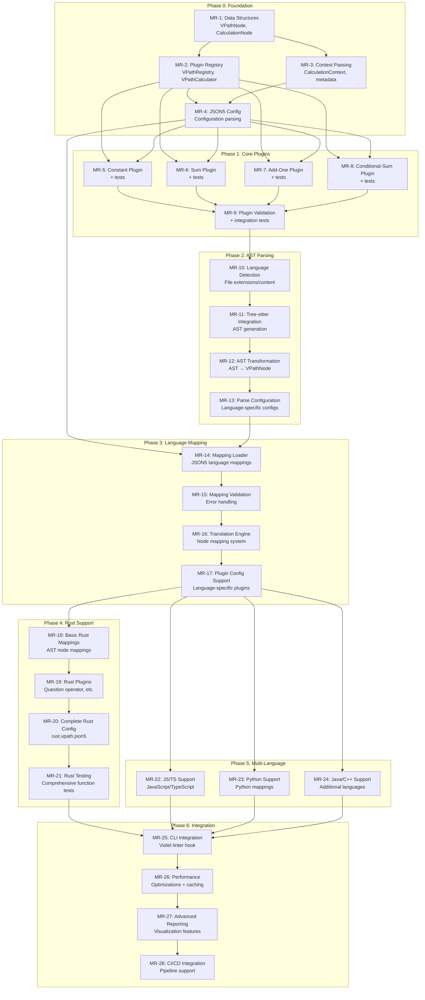

# Violet

Violet is a **V**ersatile, **I**ntuitive, & **O**pen **L**egibility **E**valuation **T**ool, a Polyglot NPATH Complexity calculation system for use with git hooks, CI/CD, and other code quality checks. Unlike traditional NPATH which assumes specific language constructs, Violet uses a language-agnostic, extensible strategy and mapping architecture to handle language-specific features while maintaining consistent complexity scoring across languages.

Violet allows for the custom definition and scoring of new control structures, while maintaining a clean, reusable, discoverable pattern for its code quality scoring.

Its general program flow follows a simple set of steps:
0. Discover and load extended NPATH (e.g., "VPath) control structures through its plugin system
1. Detect the language in use by the files under test, and translate the files into`tree-sitter` ASTs for the given languages
2. Load the AST $\rarr$ VPathNode mapping for each detected language and apply it to each AST to transform them into a unified VPath Tree
3. Score the file's functions using a generalization of the NPATH algorithm.

The true power behind Violet is in its straightforward, functional, plugin-first approach to architecture. If we're going to be the judge of how clean other people's code is, we choose to lead by example.

## Key Architectural Innovations

### 1. Language-Agnostic Unified Structure
- Core system has zero knowledge of language-specific constructs
- Built-in control structures and plugins use a single, simple `VPathNode` tree structure
- AST → VPath transformation handled is handled by external configuration files

### 2. Enforced Functional Purity
- **Metadata constraints**: We intentionally strips metadata during calculation to avoid poor plugin design.
- **Context passing**: All contextual information flows through function parameters, never stored in nodes
- **Plugin isolation**: Plugins cannot access debugging metadata, ensuring calculation consistency

### 3. Plugin-First Architecture
- **No special cases**: Core strategies implemented as plugins, not hardcoded enums
- **Self-documenting**: Core plugin implementations serve as examples for plugin developers
- **Unified interface**: Everything goes through the same plugin registration and calculation pathway
- **Proven capability**: Plugin system must be powerful enough to handle all core complexity patterns

### 4. Polyglot Extension System
- **JSON5-based mappings**: Language-specific AST→VPATH transformation rules with familiar syntax
- **Plugin registration**: Runtime registration of all complexity calculators (core and language-specific)
- **Consistent scoring**: Same plugin interface across all supported languages

## Mathematical Foundation

### Basic Formula

For a function $f$, the NPATH complexity $N(f)$ is defined as:

$$N(f) = \prod_{i=1}^{n} N(s_i)$$

Where $s_i$ represents each statement or control structure in the function.

### Control Structure Scoring

| Structure | NPATH Value | Formula |
|-----------|-------------|---------|
| Sequential statements | $N = 1$ | $N(s_1; s_2; ...; s_n) = 1$ |
| If statement | $N = N(then) + N(else)$ | $N(\text{if } c \text{ then } s_1 \text{ else } s_2) = N(s_1) + N(s_2)$ |
| If-only (no else) | $N = N(then) + 1$ | $N(\text{if } c \text{ then } s) = N(s) + 1$ |
| While loop | $N = N(body) + 1$ | $N(\text{while } c \text{ do } s) = N(s) + 1$ |
| For loop | $N = N(body) + 1$ | $N(\text{for } init; c; inc \text{ do } s) = N(s) + 1$ |
| Switch/Match | $N = \sum_{i=1}^{n} N(case_i)$ | $N(\text{switch } e \text{ of } \{case_1, ..., case_n\}) = \sum_{i=1}^{n} N(case_i)$ |
| Try-catch | $N = N(try) + \sum_{i=1}^{n} N(catch_i)$ | $N(\text{try } s_1 \text{ catch } \{c_1, ..., c_n\}) = N(s_1) + \sum_{i=1}^{n} N(c_i)$ |

### Nesting Multiplication

The key insight of NPATH is that nested structures multiply their complexity:

$$N(\text{nested}) = N(\text{outer}) \times N(\text{inner})$$

For example:
```rust
if condition1 {           // 2 paths
    if condition2 {       // 2 paths nested
        do_something();
    }
}
```

NPATH = $2 \times 2 = 4$ paths, while McCabe = $1 + 1 = 2$

## VPATH Node Data Structure

### Unified Node Design

All VPATH nodes (built-in and plugins) use the same unified structure:

```rust
#[derive(Debug, Clone, PartialEq, Serialize, Deserialize)]
pub struct VPathNode {
    /// Base complexity contribution before children calculation
    pub base_complexity: u64,
    
    /// Plugin name that handles complexity calculation for this node
    pub strategy_plugin: String,
    
    /// Debug/tooling metadata (NEVER accessible during calculation)
    pub metadata: HashMap<String, serde_json::Value>,
    
    /// Child nodes
    pub children: Vec<VPathNode>,
    
    /// Nesting depth for complexity calculations
    pub depth: u32,
}
```

### Example Node Instances

```rust
// Sequential statements: always complexity 1
VPathNode {
    base_complexity: 1,
    strategy_plugin: "constant".to_string(),
    metadata: [("source_construct", json!("block_statement"))].into_iter().collect(),
    children: vec![],
    depth: 0,
}

// If-then-else: sum of branches
VPathNode {
    base_complexity: 0,
    strategy_plugin: "conditional_sum".to_string(),
    metadata: [("source_construct", json!("if_expression"))].into_iter().collect(),
    children: vec![then_node, else_node],
    depth: 1,
}

// Rust ? operator: pre-calculated during AST transformation
VPathNode {
    base_complexity: 3,  // 3 question operators found during transformation
    strategy_plugin: "constant".to_string(),
    metadata: [
        ("source_construct", json!("question_operators")),
        ("question_count", json!(3)),
        ("error_types", json!(["Result", "Option"]))
    ].into_iter().collect(),
    children: vec![],
    depth: 0,
}
```

## Plugin-First Architecture

### Core Strategies as Plugins

All complexity calculation strategies are implemented as plugins - no hardcoded enums or special cases:

```rust
/// Calculation context passed functionally (never stored in nodes)
pub struct CalculationContext {
    pub function_metadata: HashMap<String, serde_json::Value>,
    pub type_info: Option<TypeContext>,
    pub nesting_stack: Vec<String>,
}

/// Plugin calculators receive context functionally
pub trait VPathCalculator {
    fn calculate_complexity(&self, node: &CalculationNode, context: &CalculationContext) -> u64;
    fn plugin_name(&self) -> &str;
}

/// Calculation-only view of VPathNode (metadata hidden)
pub struct CalculationNode {
    pub base_complexity: u64,
    pub children: Vec<CalculationNode>,
    pub depth: u32,
    // metadata field is INTENTIONALLY OMITTED - plugins cannot access it!
}

impl From<&VPathNode> for CalculationNode {
    fn from(node: &VPathNode) -> Self {
        Self {
            base_complexity: node.base_complexity,
            children: node.children.iter().map(|child| child.into()).collect(),
            depth: node.depth,
            // metadata is stripped during conversion
        }
    }
}

pub struct VPathRegistry {
    calculators: HashMap<String, Box<dyn VPathCalculator>>,
}

impl VPathRegistry {
    pub fn new() -> Self {
        let mut registry = Self {
            calculators: HashMap::new(),
        };
        
        // Register core strategies as plugins
        registry.register(Box::new(ConstantStrategy));
        registry.register(Box::new(SumStrategy));
        registry.register(Box::new(AddOneStrategy));
        registry.register(Box::new(ConditionalSumStrategy));
        
        registry
    }
    
    pub fn register(&mut self, calculator: Box<dyn VPathCalculator>) {
        self.calculators.insert(calculator.plugin_name().to_string(), calculator);
    }
}

/// Main calculation function - always uses plugins
pub fn calculate_complexity(node: &VPathNode, context: &CalculationContext, registry: &VPathRegistry) -> u64 {
    let calc_node = CalculationNode::from(node);  // Strips metadata for plugin
    
    registry.calculators.get(&node.strategy_plugin)
        .unwrap_or_else(|| panic!("Plugin '{}' not registered", node.strategy_plugin))
        .calculate_complexity(&calc_node, context)
}

/// Core strategy implementations serve as plugin examples

/// Sequential statements always return base complexity
pub struct ConstantStrategy;
impl VPathCalculator for ConstantStrategy {
    fn plugin_name(&self) -> &str { "constant" }
    
    fn calculate_complexity(&self, node: &CalculationNode, _context: &CalculationContext) -> u64 {
        node.base_complexity
    }
}

/// Sum all children (for switch/match cases)
pub struct SumStrategy;
impl VPathCalculator for SumStrategy {
    fn plugin_name(&self) -> &str { "sum" }
    
    fn calculate_complexity(&self, node: &CalculationNode, context: &CalculationContext) -> u64 {
        node.children.iter()
            .map(|child| calculate_complexity_calc_node(child, context))
            .sum()
    }
}

/// Add 1 to children complexity (for loops: body + exit path)
pub struct AddOneStrategy;
impl VPathCalculator for AddOneStrategy {
    fn plugin_name(&self) -> &str { "add_one" }
    
    fn calculate_complexity(&self, node: &CalculationNode, context: &CalculationContext) -> u64 {
        node.children.iter()
            .map(|child| calculate_complexity_calc_node(child, context))
            .sum::<u64>() + 1
    }
}

/// Conditional sum (if-then-else with default else=1)
pub struct ConditionalSumStrategy;
impl VPathCalculator for ConditionalSumStrategy {
    fn plugin_name(&self) -> &str { "conditional_sum" }
    
    fn calculate_complexity(&self, node: &CalculationNode, context: &CalculationContext) -> u64 {
        let then_complexity = calculate_complexity_calc_node(&node.children[0], context);
        let else_complexity = node.children.get(1)
            .map(|child| calculate_complexity_calc_node(child, context))
            .unwrap_or(1);  // Default else path
        then_complexity + else_complexity
    }
}

// Helper for recursive calculation within plugins
fn calculate_complexity_calc_node(node: &CalculationNode, context: &CalculationContext) -> u64 {
    // This would need to be implemented - likely by converting back to VPathNode reference
    // or restructuring to avoid this recursive issue
    todo!("Implementation detail: recursive calculation within plugins")
}

/// Metadata access is only available during debug/tooling phases
pub fn print_calculation_trace(node: &VPathNode, depth: usize) {
    let indent = "  ".repeat(depth);
    println!("{}Node: {} (complexity: {})", 
        indent, 
        node.metadata.get("source_construct").unwrap_or(&json!("unknown")),
        node.base_complexity
    );
    
    for child in &node.children {
        print_calculation_trace(child, depth + 1);
    }
}
```

### Metadata Usage Guidelines

**✅ Allowed metadata usage:**
- `--verbose` flag output showing source constructs
- `--debug` flag for development/troubleshooting  
- IDE integration showing complexity breakdown
- Unit test assertions about transformation correctness

**❌ Forbidden metadata usage:**
- Any access to metadata during `calculate_complexity()` execution
- Plugin logic that depends on metadata content
- Conditional calculation based on metadata values

This architectural constraint ensures:
- **Functional purity**: Calculation results depend only on node structure and context
- **Testability**: Identical nodes always produce identical complexity scores
- **Maintainability**: Debugging info can change without affecting calculation logic


## Design Rationale

### Why Remove `node_type` Field?
Traditional complexity analyzers couple the core algorithm to specific language constructs (e.g., "IfStatement", "WhileLoop"). By eliminating the `node_type` field, VPATH achieves true language agnosticism. The core system only understands mathematical combination strategies, while language-specific knowledge lives in external mapping files.

### Why Enforce Metadata Constraints?
Preventing plugins from accessing metadata during calculation eliminates a common source of bugs and inconsistency. It's too easy for plugin authors to accidentally depend on debugging information, making calculation results non-deterministic. The `CalculationNode` API design makes this category of error **impossible**.

### Why Functional Context Passing?
Storing context in nodes creates hidden coupling and makes testing difficult. Functional context passing keeps the architecture explicit - you can see exactly what information each calculation depends on. This also enables concurrent calculation since nodes remain immutable.

### Why Plugin-First Architecture?
Rather than hardcoding core strategies in enums, implementing them as plugins ensures the plugin system is powerful enough for real-world usage. Core plugin implementations serve as examples for plugin developers, and there are no special cases - everything goes through the same plugin interface. This "eat your own dog food" approach validates the plugin architecture's capabilities.

### Why JSON5 Over TOML?
JSON5 provides superior developer experience: familiar JSON syntax with comments and trailing commas, better IDE support, cleaner nested structures, and established ecosystem. While TOML is popular in Rust, JSON5 is more universally understood and tooled, making the system more accessible to developers from all backgrounds.

### Language-Specific AST Mapping

```json5
// rust.vpath.json5
{
  "node_mappings": {
    "if_expression": { 
      "base_complexity": 0,
      "strategy_plugin": "conditional_sum"
    },
    "while_expression": {
      "base_complexity": 0,
      "strategy_plugin": "add_one"
    },
    "match_expression": {
      "base_complexity": 0,
      "strategy_plugin": "sum"
    },
    "try_expression": {
      "base_complexity": 1,
      "strategy_plugin": "rust_question"
    }
  },
  
  "plugin_config": {
    "rust_question": {
      "paths_per_question": 1,
      "error_types": ["Result", "Option"]
    }
  }
}
```

## Implementation Phases

### **Phase 0: Core Plugin Architecture Foundation**
**Status: Ready to begin**
- [ ] Implement the plugin system infrastructure
- [ ] Create `VPathNode` and `CalculationNode` data structures
- [ ] Build plugin loader and registry (`VPathRegistry`)
- [ ] Establish the functional calculation context passing
- [ ] Create plugin trait definitions and interfaces (`VPathCalculator`)
- [ ] Set up JSON5 configuration parsing
- [ ] **Deliverable**: Plugin system that can load and execute basic strategy plugins

### **Phase 1: Core Strategy Plugins**
**Status: Dependent on Phase 0**
- [ ] Implement the four fundamental strategy plugins:
  - [ ] `constant` - returns base complexity
  - [ ] `sum` - sums all children 
  - [ ] `add_one` - adds 1 + sum of children
  - [ ] `conditional_sum` - conditional logic for combining children
- [ ] Create plugin configuration validation
- [ ] Build unit tests for each core strategy
- [ ] **Deliverable**: Working core complexity calculation with basic strategies

### **Phase 2: Language Detection & AST Parsing**
**Status: Dependent on Phase 1**
- [ ] Implement language detection from file extensions/content
- [ ] Integrate tree-sitter for AST generation
- [ ] Create AST → VPathNode transformation pipeline
- [ ] Handle language-specific parsing configurations
- [ ] **Deliverable**: Can parse source files into VPathNode trees

### **Phase 3: Language Mapping System**
**Status: Dependent on Phase 2**
- [ ] Implement JSON5 language mapping loader
- [ ] Create mapping validation and error handling
- [ ] Build node mapping translation from AST to VPath
- [ ] Support for language-specific plugin configurations
- [ ] **Deliverable**: Complete language-agnostic mapping system

### **Phase 4: Rust Language Support**
**Status: Dependent on Phase 3**
- [ ] Create comprehensive `rust.vpath.json5` mapping
- [ ] Implement Rust-specific complexity patterns
- [ ] Handle all Rust function types identified in coverage matrix
- [ ] Extensive testing with real Rust codebases
- [ ] **Deliverable**: Production-ready Rust complexity analysis

### **Phase 5: Multi-Language Expansion**
**Status: Dependent on Phase 4**
- [ ] Add JavaScript/TypeScript support
- [ ] Create Python language mappings
- [ ] Implement Java/C++ mappings
- [ ] **Deliverable**: True polyglot complexity analysis

### **Phase 6: Advanced Features & Integration**
**Status: Final phase**
- [ ] CLI integration with existing Violet linter
- [ ] Performance optimizations and caching
- [ ] Advanced reporting and visualization
- [ ] Integration with CI/CD pipelines
- [ ] **Deliverable**: Complete VIOLET complexity analysis tool

## Testing Strategy

Violet employs a comprehensive testing strategy that ensures robust rule enforcement across diverse, realistic code scenarios. Our testing philosophy emphasizes **creative diversity** and **edge-trigger boundary testing** to catch subtle bugs that simple test cases might miss.

### Test Structure Organization

Tests are organized in a hierarchical structure under `tests/rules/{language}/{rule_name}/`:

```
tests/rules/rust/function_max_params/
├── lenient.config.json5          # Relaxed limits for specific contexts
├── strict.config.json5           # Stricter limits for critical code
├── basic_function/
│   ├── valid.rs                  # Exactly at limit (5 params)
│   └── invalid.rs                # Exactly 1 over limit (6 params)
├── impl_method/
│   ├── valid.rs                  # &self + 4 others = 5 total
│   └── invalid.rs                # &self + 5 others = 6 total
├── async_function/
│   ├── valid.rs                  # 5 params with async complexity
│   └── invalid.rs                # 6 params with async complexity
└── ... (24 different function types)
```

### Rule-Level Configuration Strategy

Rather than duplicating config files per test case, we use **rule-level configuration** to avoid maintenance overhead:

- **`lenient.config.json5`**: Relaxed limits for prototyping, scripts, or legacy code
- **`strict.config.json5`**: Stricter limits for critical systems, APIs, or performance-sensitive code

```json5
// lenient.config.json5
{
  "rules": {
    "function_max_params": { "max_params": 8 },
    "function_max_length": { "max_function_lines": 100 },
    "function_max_depth": { "max_function_depth": 4 }
  }
}

// strict.config.json5  
{
  "rules": {
    "function_max_params": { "max_params": 3 },
    "function_max_length": { "max_function_lines": 50 },
    "function_max_depth": { "max_function_depth": 2 }
  }
}
```

### Edge-Trigger Boundary Testing

Our tests use **edge-trigger methodology** to catch boundary condition bugs:

- **`valid.rs`**: Contains code **exactly at the limit** (e.g., exactly 5 parameters)
- **`invalid.rs`**: Contains code **exactly 1 over the limit** (e.g., exactly 6 parameters)

This approach catches subtle off-by-one errors that could cause false positives or false negatives:

```rust
// valid.rs - exactly at limit (5 params)
fn inventory_restock(item_id: u32, quantity: i32, supplier: &str, 
                    priority: Priority, warehouse: &Warehouse) -> Result<(), Error> {
    // Implementation exactly at 5 parameter limit
}

// invalid.rs - exactly 1 over limit (6 params)  
fn inventory_restock(item_id: u32, quantity: i32, supplier: &str,
                    priority: Priority, warehouse: &Warehouse, 
                    notification: bool) -> Result<(), Error> {
    // Implementation with 6 parameters - should trigger violation
}
```

### Creative Diversity Philosophy

Every test case uses **completely different domains and themes** to ensure comprehensive coverage. We avoid repetitive "user processing" patterns in favor of rich, varied scenarios:

**Examples from our test suite:**
- **Pizza cost calculation** (basic functions)
- **Chemical reactor control** (impl methods)  
- **Autonomous vehicle navigation** (async functions)
- **Space probe telemetry** (trait methods)
- **Weather station monitoring** (const functions)
- **Cryptographic key generation** (unsafe functions)
- **Audio mixing algorithms** (generic functions)
- **Bioinformatics sequence analysis** (closures)

This diversity ensures that:
- **Real-world complexity** is represented in tests
- **Different programming patterns** are validated
- **Edge cases** emerge from domain-specific logic
- **Maintainers** can easily distinguish between test cases
- **Code review** is more engaging and thorough

### Comprehensive Function Type Coverage

Violet tests all 24 distinct Rust function types to ensure complete language coverage:

#### Core Function Types
- Regular functions (`fn`)
- Instance methods (`&self`, `&mut self`, `self`)
- Associated functions (`Self::new()`)
- Trait methods and default implementations

#### Special Modifiers
- Async functions and methods
- Const functions and methods  
- Unsafe functions and methods
- Generic functions with type parameters

#### Closures and Higher-Order
- Regular closures (`|x| x + 1`)
- Move closures (`move |x| x + 1`)
- Async closures
- Function pointers and higher-order functions

#### External and Special Purpose
- Extern "C" functions for FFI
- `#[no_mangle]` exported functions
- `#[test]` and `#[bench]` functions
- `main()` function variations

### Realistic Code Complexity

Test cases feature **realistic implementation complexity** rather than trivial examples:

```rust
// Instead of simple parameter counting:
fn bad_example(a: i32, b: i32, c: i32, d: i32, e: i32) {}

// We create realistic scenarios:
fn calculate_orbital_trajectory(
    spacecraft_mass: f64,
    initial_velocity: Vector3,
    target_orbit: &OrbitParameters,
    gravitational_field: &GravityModel,
    atmospheric_drag: Option<&AtmosphereModel>
) -> Result<TrajectoryPlan, NavigationError> {
    // Rich implementation with realistic space mission logic
    let gravitational_force = gravitational_field.calculate_force(spacecraft_mass);
    let drag_coefficient = atmospheric_drag
        .map(|atm| atm.drag_at_altitude(target_orbit.apogee))
        .unwrap_or(0.0);
    
    if gravitational_force.magnitude() < MIN_ESCAPE_VELOCITY {
        return Err(NavigationError::InsufficientThrust);
    }
    
    // Complex orbital mechanics calculations...
    Ok(TrajectoryPlan::new(/* realistic parameters */))
}
```

### Integration with NPATH Complexity

Our testing strategy will integrate seamlessly with the NPATH complexity system:

#### NPATH Test Cases

1. **Sequential statements**: Test that multiple statements = 1 path
2. **Simple conditionals**: Test if-then-else = 2 paths, if-only = 2 paths  
3. **Nested conditionals**: Test exponential growth (2 × 2 = 4 paths)
4. **Loops**: Test loop body + 1 exit path
5. **Match expressions**: Test sum of case paths
6. **Complex combinations**: Test realistic function scenarios

#### NPATH Examples

```rust
// NPATH = 1 (sequential)
fn simple_function() {
    let x = 1;
    let y = 2;
    println!("{}", x + y);
}

// NPATH = 2 (if-only)
fn simple_conditional(x: bool) {
    if x {
        do_something();
    }
}

// NPATH = 4 (nested conditionals: 2 × 2)
fn nested_conditionals(a: bool, b: bool) {
    if a {
        if b {
            do_something();
        }
    }
}

// NPATH = 4 (3 question operators + 1 success path)
fn rust_question_operators() -> Result<(), Error> {
    operation1()?;
    operation2()?;
    operation3()?;
    Ok(())
}
```

### Test Execution and Validation

Tests validate both **positive and negative cases**:

- **Positive validation**: `valid.rs` files should pass linting without violations
- **Negative validation**: `invalid.rs` files should trigger exactly one violation of the expected rule
- **Configuration validation**: Both lenient and strict configs should work correctly
- **Boundary precision**: Ensure violations trigger at exactly the right threshold

This comprehensive testing strategy ensures Violet provides reliable, accurate linting across diverse codebases while maintaining high code quality standards.

## Current Development Status

**We are currently positioned at the start of Phase 0**, with complete architectural design and documentation ready. Each phase delivers working functionality, allowing us to validate our architecture early and iterate based on real usage.

The phased approach ensures:
- **Early validation**: Each phase produces working software for testing our architectural decisions
- **Iterative refinement**: Real usage feedback can influence later phases
- **Milestone-driven progress**: Clear deliverables and dependency tracking
- **Risk mitigation**: Core plugin architecture proven before language-specific work begins

## Merge Request Strategy

### Merge Request Breakdown

Each phase is broken down into focused, reviewable merge requests that deliver incremental value:

#### **Phase 0: Core Plugin Architecture Foundation**
- **MR-1**: Basic data structures (`VPathNode`, `CalculationNode`, trait definitions)
- **MR-2**: Plugin registry and loading system (`VPathRegistry`, `VPathCalculator`)
- **MR-3**: Functional context passing (`CalculationContext`, metadata constraints)
- **MR-4**: JSON5 configuration parsing and validation

#### **Phase 1: Core Strategy Plugins**
- **MR-5**: Constant strategy plugin + tests
- **MR-6**: Sum strategy plugin + tests
- **MR-7**: Add-one strategy plugin + tests
- **MR-8**: Conditional-sum strategy plugin + tests
- **MR-9**: Plugin validation framework + comprehensive integration tests

#### **Phase 2: Language Detection & AST Parsing**
- **MR-10**: Language detection from file extensions/content
- **MR-11**: Tree-sitter integration foundation
- **MR-12**: AST → VPathNode transformation pipeline
- **MR-13**: Language-specific parsing configuration system

#### **Phase 3: Language Mapping System**
- **MR-14**: JSON5 language mapping loader
- **MR-15**: Mapping validation and error handling
- **MR-16**: Node mapping translation engine
- **MR-17**: Language-specific plugin configuration support

#### **Phase 4: Rust Language Support**
- **MR-18**: Basic Rust AST node mappings
- **MR-19**: Rust-specific plugins (question operator, match arms, etc.)
- **MR-20**: Complete `rust.vpath.json5` mapping file
- **MR-21**: Comprehensive Rust function type testing

#### **Phase 5: Multi-Language Expansion**
- **MR-22**: JavaScript/TypeScript language support
- **MR-23**: Python language mappings
- **MR-24**: Java/C++ language mappings

#### **Phase 6: Advanced Features & Integration**
- **MR-25**: CLI integration with existing Violet linter
- **MR-26**: Performance optimizations and caching
- **MR-27**: Advanced reporting and visualization
- **MR-28**: CI/CD pipeline integration

### Dependency Graph



### Key Implementation Insights

#### **Parallelization Opportunities** 🚀
- **MR-5 through MR-8**: Core strategy plugins can be developed in parallel once registry is ready
- **MR-22 through MR-24**: Multi-language support can be developed independently
- **MR-1 and MR-3**: Data structures and context passing could potentially be parallel

#### **Critical Path Bottlenecks** ⚠️
- **MR-2 (Plugin Registry)**: Blocks all plugin development
- **MR-9 (Plugin Validation)**: Gates entry to AST parsing work
- **MR-17 (Plugin Config Support)**: Must complete before any language-specific work
- **MR-25 (CLI Integration)**: Required before final optimization work

#### **Strategic MR Sizing** 📏
Each MR is sized to be:
- **Reviewable**: ~200-400 lines of code with focused scope
- **Testable**: Includes comprehensive tests for new functionality
- **Incrementally Valuable**: Adds working functionality, not just scaffolding  
- **Independent**: Minimal merge conflicts with parallel work

#### **Recommended Sprint Strategy** 🎯

1. **Sprint 1**: MR-1, MR-2, MR-3 (Foundation sprint)
2. **Sprint 2**: MR-4, then MR-5/6/7/8 in parallel (Plugin sprint)
3. **Sprint 3**: MR-9, MR-10, MR-11 (Integration + AST foundation)
4. **Sprint 4**: MR-12, MR-13, MR-14 (AST transformation)
5. **Sprint 5**: MR-15, MR-16, MR-17 (Language mapping system)
6. **Sprint 6**: MR-18, MR-19, MR-20 (Rust support)
7. **Sprint 7**: MR-21 + MR-22/23/24 in parallel (Testing + multi-language)
8. **Sprint 8**: MR-25, MR-26, MR-27, MR-28 (Final integration)

This structure allows for **~2 month delivery** with proper parallelization, while maintaining high code quality through focused, reviewable MRs. Each MR delivers working functionality that can be tested and validated independently.

**Critical Milestone**: After MR-9, we'll have a **fully working complexity calculator** - just with hardcoded nodes instead of parsed ones. Perfect for early validation of our architectural decisions!

## Potential Challenges

1. **Exponential growth**: VPATH can produce very large numbers quickly
2. **Language-specific constructs**: Each language has unique complexity patterns
3. **Performance**: Deep nesting could cause stack overflow in recursive calculation
4. **Plugin ecosystem**: Balancing flexibility with performance and correctness

## References

- Nejmeh, B.A. (1988). "NPATH: a measure of execution path complexity and its applications"
- McCabe, T.J. (1976). "A Complexity Measure"
- Tree-sitter documentation for polyglot AST parsing