# Safe Key Management

Most Key Management solutions for MCPs kind of suck. They're either not actually secure (i.e., pasting the key in your mcps.json), or using a key management system that's annoying/intrusive to the user experience.

Ideally, key management for MCPs should:
- Keep your keys safe
  - Secrets stay local
  - Secrets stay ephemeral (no persistent in-memory cache)
  - Secrets use second-layer encryption
  - Second-layer encryption for them should only be decryptable on the system the MCP is running on
  - Device-specific key derivation prevents secrets from being accessible on different machines
- Just do its thing behind the scenes, just like running the MCP itself
- Ask for you to provide keys only when actually needed
- Authenticate ONCE for access to all keys using a non-annoying method (i.e., an environment variable to pass the authentication through to in your bash/zsh configs)
- Sessionless design: derived keys are stored like SSH keys for service restarts

## CLI API

```
keeper -h

Secrets management for Kernelle, the AI toolshed.

usage: keeper <command>

Commands:
  store         Stores a secret
  read          Retrieves a secret
  ls, list      List available secrets

Options:
  -h, --help    Display this help section
  --version     Displays the version of this tool
```

```
keeper store -h

Stores a secret

usage: keeper store [-g <group-name>] <secret-name> [<secret>]

Arguments:
  <secret-name>   The key/name to store the secret as. Good names use-bash-safe-naming patterns.
  <secret>        The actual secret to save. If not provided, will prompt securely.

Options
  -g, --group <group-name>    The group to store the secret under. Good group names use-bash-safe-naming patterns.
  -h, --help                  Displays this help section
```

```
keeper read -h

Retrieves a secret

usage: keeper read [-g <group-name>] <secret-name>

Arguments:
  <secret-name>   The key/name of the secret. Good names use-bash-safe-naming patterns.

Options:
  -g, --group <group-name>    The group the secret is stored under. Good group names use-bash-safe-naming patterns.
  -h, --help                  Displays this help section
```

```
keeper ls, keeper list

Lists available secrets in a POSIX friendly manner. eg:
GROUP          SECRET NAME
general        secret-1
general        secret-2
general        ...
general        secret-n
group-name     grouped-secret-1
group-name     grouped-secret-2
group-name     ...

Options:
  -g, --group   Filter the listing by group. If the group does not exist, no output will be provided.
  -h, --help    Displays this help section
```

## Security Architecture

### Key Derivation
- Master key is derived from:
  - User's system password (prompted once, then derived key cached)
  - Device-specific fingerprint (hardware UUID, OS identifiers - robust against minor upgrades)
- Uses strong KDF (Argon2 or PBKDF2) to combine these inputs
- Device fingerprint serves as an implicit salt (prevents rainbow table attacks across devices)
- Derived key is stored securely in `~/.kernelle/keeper.key` (like SSH private key)
- Key file has restricted permissions (600) and is reused for service restarts
- User prompted for password only when derived key doesn't exist or is invalid

### Encryption
- Secrets encrypted with AES-256-GCM at rest
- No persistent in-memory credential cache - secrets are ephemeral
- Encrypted blobs stored in `~/.kernelle/secrets.json`
- Each secret has its own unique nonce (required for AES-GCM security)
- No separate salt needed (device fingerprint provides uniqueness)

### Device Changes
- If device password changes, re-derive key and re-encrypt all secrets
- Migration tool available for device transfers or major hardware changes
- Device fingerprint designed to be stable across minor system updates

### Memory Security
- Secrets zeroed from memory immediately after use
- No long-lived storage of decrypted values
- Secure memory handling throughout

## Keeper Daemon

### Purpose
The `keeper-daemon` is a minimal background service with a single responsibility: hold the derived master key in memory to eliminate password prompts.

### Responsibilities
- **Key Storage Only**: Hold the derived master key in secure memory
- **Simple IPC**: Respond to "get master key" requests via Unix socket
- **Session Management**: Start on login, cleanup on logout
- **Memory Security**: Secure memory allocation and cleanup

### What the Daemon Does NOT Do
- **No secret encryption/decryption** - `keeper` CLI/library handles this
- **No secret storage** - `keeper` CLI/library reads/writes files directly  
- **No business logic** - just a secure key container

### Architecture

```mermaid
graph TB
    CLI[keeper CLI]
    DAEMON[keeper-daemon]
    
    CLI <-->|get_key / master_key| DAEMON
    
    subgraph CLI_BOX[" "]
        direction TB
        CLI_TITLE[CLI Responsibilities]
        CLI_ENCRYPT[🔒 encrypt/decrypt]
        CLI_IO[📁 file I/O]
        CLI_PROMPT[💬 user prompts]
        CLI_LOGIC[⚙️ Business logic]
        
        CLI_TITLE --- CLI_ENCRYPT
        CLI_TITLE --- CLI_IO
        CLI_TITLE --- CLI_PROMPT
        CLI_TITLE --- CLI_LOGIC
    end
    
    subgraph DAEMON_BOX[" "]
        direction TB
        DAEMON_TITLE[Daemon Responsibilities]
        DAEMON_KEY[🗝️ Master Key Storage]
        DAEMON_SOCKET[🔌 Unix Socket IPC]
        
        DAEMON_TITLE --- DAEMON_KEY
        DAEMON_TITLE --- DAEMON_SOCKET
    end
    
    CLI_BOX -.->|provides| CLI
    DAEMON_BOX -.->|provides| DAEMON
```


### IPC Protocol (Ultra Simple)
```
Client Request:  "GET_KEY\n"
Daemon Response: "<32-byte-key>" | "ERROR: <message>"
```

### Daemon Commands
```bash
# Start daemon (prompts for password once, derives and caches key)
keeper agent start

# Check if daemon is running and has valid key
keeper agent status

# Stop daemon (securely clears key from memory)
keeper agent stop

# Stop, then start the daemon again.
keeper agent restart
```

### Fallback Behavior
If daemon is not running, `keeper` CLI:
1. Tries to load key from `~/.kernelle/keeper.key`
2. If missing/invalid, prompts user for password
3. Derives key, uses it, then discards from memory
4. Optionally saves derived key to file for next time

This keeps the daemon **dead simple** - it's just a secure memory container for one piece of data.

## Integration Philosophy

### Service-Agnostic API
`keeper` provides a simple trait-based interface that handles all secret management complexity:

```rust
pub trait SecretProvider {
  fn get_secret(&self, group: &str, name: &str) -> Result<String>;
  fn store_secret(&self, group: &str, name: &str, value: &str) -> Result<()>;
}
```

### Transparent Secret Handling
Services and tools can request secrets without worrying about:
- **Existence checking** - `keeper` handles missing secrets automatically
- **User prompting** - If a secret doesn't exist, user is prompted seamlessly
- **Encryption/decryption** - All cryptographic operations are transparent
- **Storage management** - File paths, permissions, and persistence handled internally
- **Device compatibility** - Key derivation and device fingerprinting abstracted away

### Usage Pattern
```rust
// Service just asks for what it needs
let api_key = secret_provider.get_secret("github", "token")?;

// keeper handles:
// 1. Check if secret exists
// 2. If not, prompt: "GitHub token not found. Please enter your GitHub token:"
// 3. Encrypt and store the secret
// 4. Return the secret value
// 5. Zero the secret from memory
```

### Benefits
- **Zero configuration** - Services work out of the box
- **User-friendly** - Prompts appear only when actually needed
- **Secure by default** - All secrets encrypted and ephemeral
- **Sessionless** - Works across service restarts without re-authentication

### Testing Support
`keeper` provides a mock implementation for testing scenarios:

```rust
pub struct MockSecretProvider {
  secrets: HashMap<(String, String), String>,
}

impl MockSecretProvider {
  pub fn new() -> Self { /* ... */ }
  
  pub fn with_secret(mut self, group: &str, name: &str, value: &str) -> Self {
    self.secrets.insert((group.to_string(), name.to_string()), value.to_string());
    self
  }
}

impl SecretProvider for MockSecretProvider {
  fn get_secret(&self, group: &str, name: &str) -> Result<String> {
    // Returns pre-configured test secrets, no prompting
  }
  
  fn store_secret(&self, group: &str, name: &str, value: &str) -> Result<()> {
    // Stores in memory for test verification
  }
}
```

Usage in tests:
```rust
#[test]
fn test_service_functionality() {
  let mock_secrets = MockSecretProvider::new()
    .with_secret("github", "token", "test_token_123");
  
  let service = MyService::new(Box::new(mock_secrets));
  // Test service logic without real secrets or user prompts
}
```

## Implementation Plan

Given that `sentinel` already provides a solid foundation with CLI commands and 70% of the required functionality, the migration to `keeper` should be done in phases to maintain stability while adding the missing security and daemon features.

### Phase 1: Security Hardening 🔒
**Goal:** Fix cryptographic weaknesses in current `sentinel` implementation

- [ ] **Replace weak key derivation**
  - [ ] Remove `DefaultHasher` usage in `encryption.rs`
  - [ ] Implement Argon2 or PBKDF2 for key derivation
  - [ ] Add user password component to key derivation
  - [ ] Maintain device fingerprint as implicit salt
  - [ ] Ensure backward compatibility with existing secrets (migration path)

- [ ] **Enhance device fingerprinting**
  - [ ] Make device fingerprint more robust (hardware UUID, OS identifiers)
  - [ ] Test stability across system updates
  - [ ] Handle edge cases (VM migrations, hardware changes)

- [ ] **Memory security improvements**
  - [ ] Implement secure memory zeroing for sensitive data
  - [ ] Add proper cleanup in error paths
  - [ ] Audit for memory leaks of sensitive data

**Acceptance Criteria:**
- All secrets use cryptographically secure key derivation
- User password required for secret access
- Device fingerprint remains stable across minor system changes
- Memory containing secrets is properly zeroed after use

### Phase 2: Rename and API Alignment 🔄
**Goal:** Rename `sentinel` to `keeper` and align CLI with design

- [ ] **Rename binary and crate**
  - [ ] Rename `crates/sentinel` to `crates/keeper`
  - [ ] Update binary name from `sentinel` to `keeper`
  - [ ] Update all internal references and documentation
  - [ ] Create alias/symlink for backward compatibility during transition

- [ ] **Align CLI API with design**
  - [ ] Map existing commands to new structure:
    - `sentinel store <service> <key> <value>` → `keeper store [-g <service>] <key> [<value>]`
    - `sentinel get <service> <key>` → `keeper read [-g <service>] <key>`
    - `sentinel list` → `keeper list [-g <group>]`
  - [ ] Implement group concept (use service name as default group)
  - [ ] Add `-g, --group` option support
  - [ ] Maintain backward compatibility with old command structure

- [ ] **Update trait interface**
  - [ ] Rename `CredentialProvider` to `SecretProvider`
  - [ ] Update method signatures: `get_credential()` → `get_secret()`
  - [ ] Change parameters from `(service, key)` to `(group, name)`
  - [ ] Provide compatibility wrapper for existing integrations

**Acceptance Criteria:**
- `keeper` command works with new CLI syntax
- All existing `sentinel` functionality preserved
- Backward compatibility maintained for services using old trait
- Group concept properly implemented

### Phase 3: Daemon Implementation 🔧
**Goal:** Add minimal daemon for master key caching

- [ ] **Create keeper-daemon binary**
  - [ ] Implement minimal daemon with single responsibility: key storage
  - [ ] Unix socket IPC with simple protocol: `"GET_KEY\n"` → `"<32-byte-key>"`
  - [ ] Secure memory allocation for master key
  - [ ] Proper daemon lifecycle management (start/stop/restart)

- [ ] **Daemon commands**
  - [ ] `keeper agent start` - Start daemon, prompt for password once
  - [ ] `keeper agent status` - Check daemon status and key validity
  - [ ] `keeper agent stop` - Stop daemon, clear key from memory
  - [ ] `keeper agent restart` - Restart daemon

- [ ] **Fallback behavior**
  - [ ] If daemon not running, `keeper` CLI prompts for password
  - [ ] Load/save derived key from `~/.kernelle/keeper.key`
  - [ ] Graceful degradation when daemon unavailable

- [ ] **Session management**
  - [ ] Auto-start daemon on login (optional)
  - [ ] Cleanup on logout/shutdown
  - [ ] Handle daemon crashes gracefully

**Acceptance Criteria:**
- Daemon successfully caches master key in memory
- IPC communication works reliably
- CLI falls back gracefully when daemon unavailable
- No password prompts during normal operation after initial setup

### Phase 4: Integration Updates 🔗
**Goal:** Update existing services to use new `keeper` instead of `sentinel`

- [ ] **Update service integrations**
  - [ ] Update `jerrod` to use `SecretProvider` trait
  - [ ] Update `blizz` credential handling
  - [ ] Update any other services using `sentinel`
  - [ ] Test all integrations work with new system

- [ ] **Environment variable support**
  - [ ] Implement `KEEPER_AUTH` environment variable support
  - [ ] Allow password to be passed through environment for automation
  - [ ] Document security implications and best practices

- [ ] **Migration utilities**
  - [ ] Create migration tool for existing `sentinel` credentials
  - [ ] Handle file path changes (`sentinel/` → `keeper/`)
  - [ ] Provide rollback capability during transition

**Acceptance Criteria:**
- All services work seamlessly with new `keeper` system
- No functionality lost during migration
- Environment variable authentication works
- Migration from old `sentinel` data successful

### Phase 5: Enhanced Features ✨
**Goal:** Add advanced features and polish

- [ ] **Enhanced CLI features**
  - [ ] Improve list formatting and filtering
  - [ ] Add export/import functionality for backup/restore
  - [ ] Add secret validation and health checks
  - [ ] Better error messages and user guidance

- [ ] **Advanced security features**
  - [ ] Key rotation functionality
  - [ ] Migration tools for device changes
  - [ ] Optional two-factor authentication
  - [ ] Audit logging for secret access

- [ ] **Developer experience**
  - [ ] Comprehensive documentation
  - [ ] Integration examples and tutorials
  - [ ] Performance optimization
  - [ ] Extended test coverage

**Acceptance Criteria:**
- All advanced features work as designed
- Documentation is complete and accurate
- Performance meets requirements
- Test coverage >90%

### Phase 6: Cleanup and Deprecation 🧹
**Goal:** Remove old code and finalize migration

- [ ] **Remove deprecated code**
  - [ ] Remove old `sentinel` crate after all integrations migrated
  - [ ] Remove compatibility wrappers
  - [ ] Remove old file paths and configurations
  - [ ] Clean up documentation references

- [ ] **Final validation**
  - [ ] Full system testing with all services
  - [ ] Security audit of final implementation
  - [ ] Performance benchmarking
  - [ ] User acceptance testing

**Acceptance Criteria:**
- No old `sentinel` code remains
- All functionality working in production
- Security requirements fully met
- Performance acceptable for all use cases

---

**Total Estimated Timeline:** 3-4 weeks
- Phase 1: 1 week (critical security fixes)
- Phase 2: 3-4 days (renaming and API alignment)
- Phase 3: 1 week (daemon implementation)
- Phase 4: 3-4 days (integration updates)
- Phase 5: 1 week (enhanced features)
- Phase 6: 2-3 days (cleanup)

**Dependencies:**
- Phase 2 depends on Phase 1 completion
- Phase 3 can be developed in parallel with Phase 2
- Phase 4 depends on Phases 2 and 3
- Phases 5 and 6 are sequential after Phase 4

