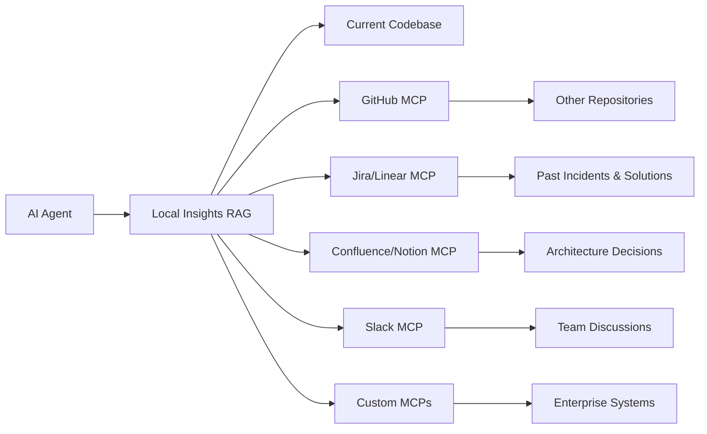

# Organizational Knowledge Integration

One of Blizz's most powerful features is that your AI agents aren't limited to just the current codebase. Through MCPs and extensions, insights can aggregate knowledge from across your entire organizational ecosystem.

## How It Works

**Traditional AI Assistants:** Only know about files in your current workspace
**Blizz-Enhanced AI Agents:** Can access and remember context from anywhere in your organization



## Real-World Examples

### Incident Response with Context
```bash
# AI agent can now say:
"I see you're getting a similar error to incident PROD-2847 from last month. 
Based on the Jira ticket and the solution that worked, try checking the 
connection pool size - the team increased it from 10 to 50 in the user-service 
config and that resolved the timeout issues."
```

### Architecture Decisions with History
```bash
# Instead of generic advice:
"Based on the RFC in Confluence from the platform team, they specifically 
recommended against using Redis for session storage in microservices due to 
the disaster recovery requirements. The team standardized on PostgreSQL 
with connection pooling for session data."
```

### Cross-Team Knowledge Sharing
```bash
# AI agent remembers solutions from other teams:
"The payments team solved this exact authentication flow in the billing-service 
repo. Looking at their implementation, they handled the OAuth2 refresh token 
rotation by storing the tokens in encrypted environment variables and using 
a middleware pattern. Here's how you can adapt their solution..."
```

## Organizational Knowledge Sources

### Development Tools
- **GitHub/GitLab**: Other repositories, PRs, issues, discussions
- **CI/CD Systems**: Deployment patterns, pipeline configurations
- **Code Review Tools**: Past review comments, common patterns

### Project Management
- **Jira/Linear/Asana**: Past incidents, solutions, requirements
- **Confluence/Notion**: Architecture decisions, runbooks, processes
- **Documentation Sites**: API specs, deployment guides

### Communication Platforms  
- **Slack/Discord/Teams**: Team discussions, decisions, troubleshooting
- **Email Archives**: Important technical decisions and context
- **Wiki Systems**: Tribal knowledge and procedures

### Enterprise Systems
- **Monitoring/Observability**: Past incidents and resolution patterns
- **Security Tools**: Compliance requirements, security patterns
- **Database Systems**: Schema decisions, query patterns

## Enterprise Benefits

### Reduced Knowledge Silos
- AI agents can share context across teams automatically
- New team members get access to organizational knowledge immediately
- Solutions get reused instead of reinvented

### Faster Incident Resolution
- AI agents remember how similar issues were resolved before
- Context includes not just the technical fix but the reasoning
- Escalation patterns and team expertise mapped automatically

### Better Architecture Decisions
- AI agents understand past decisions and their outcomes
- Can warn against approaches that didn't work before
- Suggest patterns that have proven successful in your organization

### Improved Onboarding
- New developers get AI assistance that understands company context
- No more "ask Sarah, she knows how this works" - the knowledge is captured
- Personal configurations layer on top of organizational knowledge

## Privacy and Security

### Local-First Approach
- All organizational knowledge stored locally by default
- No data leaves your infrastructure unless you explicitly configure it
- Full control over what knowledge is captured and retained

### Transparent, Hackable Architecture
- Insights are just markdown files in folders - completely auditable
- Use git for team collaboration: shared insight repositories with normal push/pull workflows
- Zero vendor lock-in: even without Blizz, you have readable text files
- Integrate with existing backup and version control infrastructure
- Hack with standard Unix tools: `grep`, `sed`, `awk` all work on insights

### Configurable Access Control
- Choose which MCPs and data sources to enable per project
- Personal vs. team vs. organization-wide knowledge boundaries
- Audit trail for what knowledge AI agents access and store

### Enterprise Deployment Options
- Run insights server within your VPC/network
- Connect to your existing enterprise search infrastructure
- Integrate with your identity and access management systems

## Getting Started with Organizational Knowledge

### Phase 1: Current Project Context
```bash
# Start with basic codebase knowledge
blizz link
# AI agent now understands current project
```

### Phase 2: Add Development Tools
```bash
# Configure GitHub MCP for related repositories
secrets store github access_token
# AI agent can now learn from your other repos
```

### Phase 3: Add Project Management
```bash
# Add Jira/Linear integration
secrets store jira api_token
secrets store linear api_key
# AI agent now understands past incidents and requirements
```

### Phase 4: Add Team Communication
```bash
# Add Slack integration (with appropriate permissions)
secrets store slack bot_token
# AI agent now understands team discussions and decisions
```

## Best Practices

### Knowledge Curation
- Regularly review and organize insights by topic
- Use consistent naming conventions for organizational knowledge
- Archive outdated or incorrect information

### Privacy Boundaries
- Be thoughtful about what organizational knowledge to capture
- Respect team and individual privacy preferences  
- Use topic-based organization to control knowledge access

### Team Collaboration
- Share insights that benefit the whole team
- Use standardized formats for architecture decisions and incident reports
- Create templates for common knowledge patterns

---

This organizational knowledge integration is what transforms Blizz from "better code completion" to "AI agents that actually understand how your organization works."
